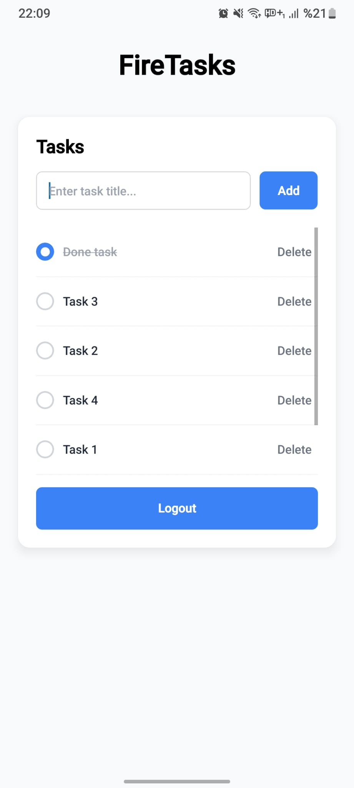

# Firebase Auth Tasks

A simple **React Native** task management app using **Firebase Authentication** and **Firestore**, built with **Expo** and **React Query**.

## Features

- User authentication (Sign up, Sign in, Sign out) using Firebase Auth
- Task CRUD operations:
  - Create, update (complete toggle), delete tasks
  - Tasks are stored per-user in Firestore under `users/{uid}/tasks`
- Real-time task updates using React Query
- AsyncStorage to persist logged-in user
- Clean and responsive UI with TailwindCSS
- Expo Router for navigation between screens

## Screens

- **Signup**: Create a new user
- **Signin**: Login with existing credentials
- **Tasks**: List, add, update, and delete tasks

## Screenshots

<p>



</p>

## Folder Structure

```
firebase-auth-tasks/
├── app/                    
│   ├── _layout.tsx
│   ├── index.tsx
│   ├── signup.tsx
│   ├── signin.tsx
│   ├── tasks.tsx
│   ├── details.tsx
│   └── not-found.tsx
├── assets/                 
├── components/             
├── hooks/                  
│   ├── useTasks.ts
│   ├── useAddTask.ts
│   ├── useUpdateTask.ts
│   ├── useDeleteTask.ts
│   ├── useAsyncStorage.ts
│   ├── useSignin.ts
│   ├── useSignout.ts
│   └── useSignup.ts
├── services/               
│   └── firebaseConfig.ts
├── global.css             
├── package.json
├── tailwind.config.js
└── tsconfig.json
```

## Installation

1. Clone the repository:

    git clone https://github.com/yourusername/firebase-auth-tasks.git
    cd firebase-auth-tasks

2. Install dependencies:

    npm install
# or
    yarn install


3. Run the app:

    npm run start

## Usage

1. Sign up or sign in using Firebase Authentication
2. Add tasks
3. Update task completion status
4. Delete tasks
5. Logout and navigate to login screen (using Expo Router)
